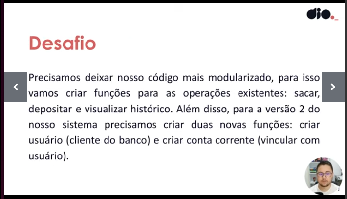
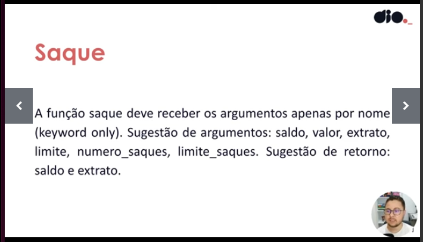
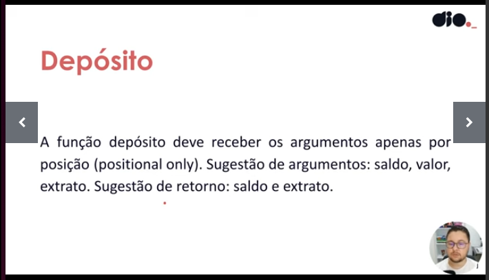
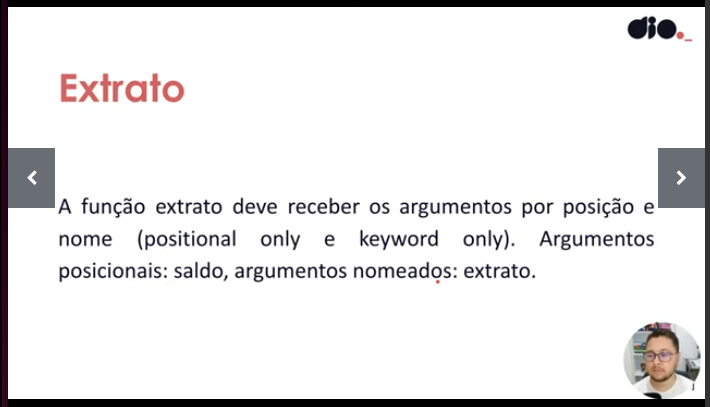
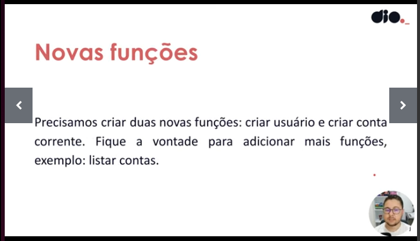
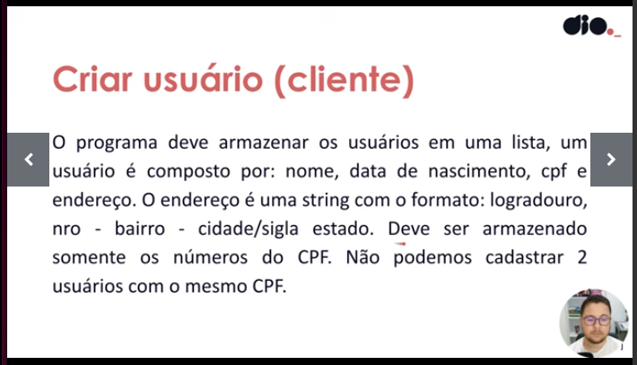
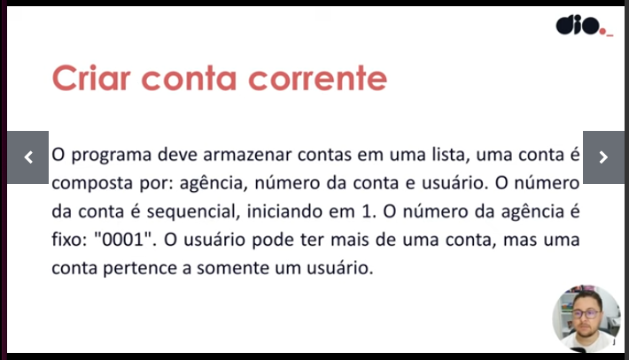
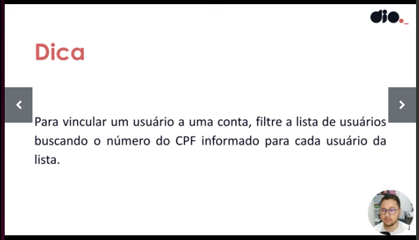

# Python AI Backend Developer - [DIO](https://www.dio.me/bootcamp/coding-future-vivo-python-ai-backend-developer)

## Projeto prático II

### Requisitos dos sistema:
* Separação de funções;

* Requisitos;

* Novas funções;

